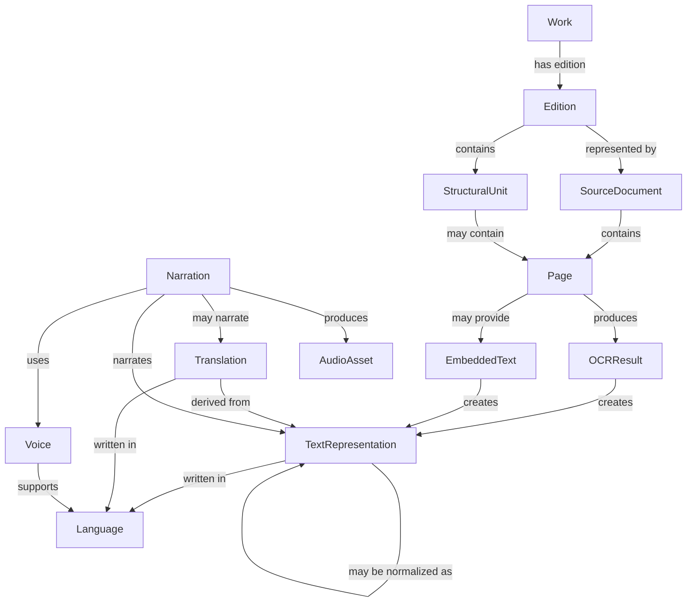

# Echo architecture

## Product and architectural direction

Echo's long-term goal is to become a multilingual document and knowledge
platform. The current Traditional Chinese OCR and Hong Kong Cantonese narration
focus is the first supported configuration, not a permanent product boundary.

The central architectural concept is a multilingual document knowledge model.
Audio is an important output, but it may not be the only future representation.
Echo should be able to distinguish among works, editions, source documents,
document structure, pages, text representations, languages, translations,
voices, narrations, and audio assets.

The MVP remains focused on PDF and image ingestion, text extraction or OCR, text
normalization, TTS generation, and audio playback. Translation, graph search,
semantic extraction, cross-book linking, embeddings, and similar capabilities
are not part of the approved MVP.

OCR, normalization, translation, and TTS should be treated as services that
create or transform representations linked to source material. Do not treat one
OCR output or one audio file as the only permanent representation of a document.

## Conceptual Domain Knowledge Graph

Echo's domain is graph-shaped: the important product meaning comes from both
entities and the relationships among them. This section is a conceptual model of
the domain. It is not a repository diagram, and it is not a commitment to using
a graph database.

PostgreSQL or Supabase Postgres remains the expected initial persistence
approach. Graph-specific infrastructure should be considered only if future
features require relationship traversals that the relational model cannot
support well enough for the product.



The concepts above should guide future domain modeling:

- `Work`: the abstract intellectual work, independent of format or edition.
- `Edition`: a specific published version of a work.
- `SourceDocument`: an uploaded PDF or image collection representing an edition.
- `StructuralUnit`: a chapter, section, page range, or other document structure.
- `Page`: one ordered page from a source document.
- `TextRepresentation`: extracted, OCR, normalized, translated, or otherwise
  transformed text tied back to source material.
- `Language`: the written language or locale configuration for text or voice.
- `Translation`: a text representation derived into another language.
- `Voice`: a narration voice with supported locales.
- `Narration`: an instruction or result linking a voice to text being narrated.
- `AudioAsset`: stored audio produced from a narration.

This model is intentionally broader than the current schema. Each milestone
should implement only the subset needed for approved product behavior while
preserving clear source and derivation links where practical.

## System overview

Echo is a monorepo with two independently started applications:

```text
Browser (Next.js)
  → multipart upload
FastAPI
  → validation and source-specific preparation
Temporary local storage (milestones 1–4)
```

The frontend explains the workflow, gathers a confirmed page order, and shows
results. The backend is authoritative for validation, file preparation, and
representation-producing services.

## Frontend responsibilities

- Present ordinary book language rather than processing jargon.
- Provide separate PDF and page-photo choices.
- Check obvious file type, size, and count problems before upload.
- Preview, reorder, rotate, remove, and add page images.
- Send images in confirmed order with one rotation value per image.
- Display structured backend results and understandable errors.
- Show whole-book text progress, page-level results, and retry controls.

Interactive upload logic is kept in a focused Client Component. Static route
content remains in Server Components.

## Backend responsibilities

- Enforce upload size, count, rotation, decoded format, and pixel limits.
- Store uploads under generated UUID directories and generated filenames.
- Inspect every PDF page rather than inferring the whole document from page one.
- Correct EXIF orientation before applying the confirmed user rotation.
- Return stable typed responses and structured errors.
- Save one portable local book record with a shared ordered page list.

Routes coordinate requests; PDF, image, validation, storage, OCR, and book
orchestration logic live in independently testable services.

## Shared ordered-page architecture

The current normalization boundary is:

```text
PDF                         Page photographs
 ├─ embedded text page       ├─ confirmed order
 └─ rendered scanned page    └─ normalized image
            \                /
             ordered book pages
                     ↓
          text → segments → audio
```

Milestone 2 creates local `BookRecord` and `BookPageRecord` models. PDF and
photo uploads now produce the same ordered page fields: page ID and number,
source paths, normalized path, extraction method, extracted text, rotation,
status, and timestamps. The records are stored together in `book.json` until a
database is introduced.

In the long-term conceptual model, these local records are an early practical
form of `SourceDocument`, `Page`, and `TextRepresentation`. They should evolve
toward clearer work, edition, structure, and provenance relationships when those
features become necessary.

## PDF processing flow

1. Stream the upload to a size-limited UUID directory.
2. Confirm the PDF signature and ask PDFium to open the document.
3. Reject unreadable, password-protected, or zero-page documents.
4. Extract text from every page through `PdfProcessingService`.
5. Count non-whitespace characters per page.
6. Save text for pages with at least `PDF_TEXT_MIN_CHARACTERS` and mark them
   `embedded_text`.
7. Render every `requires_ocr` page to an ordered normalized PNG.
8. Save both page kinds in one ordered page list and return `text`, `scanned`,
   or `mixed` from the full set.

`PdfProcessingService` owns `validate_pdf()`, `count_pages()`,
`extract_page_text()`, `render_page()`, and `classify_pdf()`. No PDF-library calls
belong in routes.

## Image processing flow

1. Receive files in the user's confirmed order.
2. Enforce per-file size and total-count limits.
3. Decode each file with Pillow and accept only actual JPEG or PNG content.
4. Reject images over the configured decoded pixel count.
5. Save the original using a generated filename.
6. Correct EXIF orientation.
7. Apply the confirmed clockwise rotation: 0°, 90°, 180°, or 270°.
8. Save an ordered normalized PNG processing copy.

Automatic two-page splitting, dewarping, and background removal are excluded.

## OCR flow

Milestone 3 added an `OcrProvider` boundary with mock and PaddleOCR
implementations. The one-page preview endpoint resolves a normalized page from
the shared page record, calls one provider, and returns text lines, confidence
estimates, and processing time. It does not update `book.json`.

The real provider lazily imports PaddleOCR so the API can still start in mock
mode without the optional runtime. It uses the PP-OCRv5 mobile detector and
multilingual recognizer on CPU, limits the longest inference side to 2,000
pixels, and stores model files under the ignored local data directory. The
mobile recognizer supports Traditional Chinese while using substantially less
memory than the server models.

Milestone 4 sends every unfinished OCR page through this same boundary, while
embedded-text pages keep their already extracted text. The orchestration service
processes pages in order and writes `book.json` after each state transition.
Completed pages are skipped when a stopped job resumes, and failed pages can be
retried individually. When every page is complete, the book becomes
`text_ready`; `ready` remains reserved for a later audio-ready state.

OCR output is a derived text representation, not the document itself. Later
normalization, correction, translation, or narration should preserve a practical
link back to the page text that produced it.

The API starts small jobs with FastAPI `BackgroundTasks`. An in-memory registry
prevents duplicate jobs inside one backend process and lets the frontend tell a
running job from stale persisted status. This is intentionally not a durable
queue: after a backend restart, the UI offers to continue from the first
unfinished page.

## Planned narration and speech flow

In milestones 5 and 6, page text will be divided into safe ordered segments.
Each audio record will retain its source text and source page. A mock provider
will work locally before Azure Speech is enabled. The initial real voice target
is Hong Kong Cantonese with a configurable `zh-HK` voice, but the architecture
should keep voice, locale, narration, and audio asset relationships explicit
enough to support additional languages later.

## Storage model

Milestone 2 uses:

```text
backend/data/<book-id>/
├── book.json                  # book plus ordered page metadata
├── source.pdf                 # PDF flow
├── originals/                 # original photo uploads, image flow
└── pages/                     # normalized photos or rendered PDF pages
```

Embedded-text PDF pages can have no processing image. Photo pages and scanned
PDF pages have a normalized PNG path. Each page stores its extracted text,
status, and a friendly error when text preparation fails. All stored paths are
relative to the UUID book directory.

The complete MVP model will add `audio_segments` and `reading_progress`, then
move the local book/page records to Supabase in milestone 8. User ownership and
Row Level Security will be designed with authentication.

Postgres tables can represent the conceptual graph with normal foreign keys,
join tables, and indexes. A graph database, RDF store, vector database, or
embedding system should not be introduced unless a future approved feature
requires it and the tradeoffs have been evaluated.

## Planned deployment

- Next.js frontend: suitable for Vercel
- Containerized FastAPI backend: suitable for Railway, Render, or similar
- Database and object storage: Supabase in a later milestone
- Long-running processing: a worker queue only when measurements demonstrate a
  need

Local development must remain functional without cloud or paid services.
